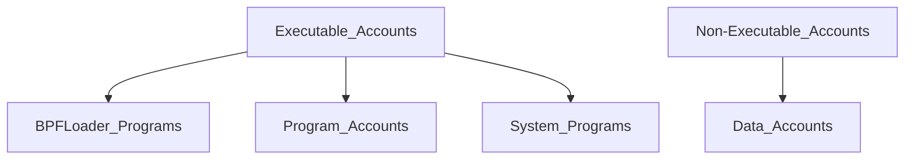
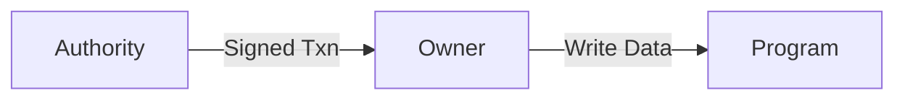

# Solana: Account Models

## TL;TR

Different from Ethereum, where the smart contract contains both the execution logic and the state, the smart contract on Solana is stateless, meaning it only contains the execution logic. So where can we find those states? Solana tackles its complex account model.

In Solana, the smart contract is the **program account**, and the states are stored in the **data account**. By separating the logic and the state, Solana makes program deployment more efficient.

For instance, in Ethereum, when deploying ERC20 tokens, we need to import or copy the ERC20 codes from OpenZeppline, and deploy. Each ERC20 has the identical logic. The difference is only the token’s metadata *(name, symbol, supply, etc.)*, and balances. Since they have the same logic, why there is not a global program to handle the ERC20’s logic? That is the solution of Solana. 

The **SLPToken Program** is the *generic program* that handles all the token operation for both ERC20 and NFT. And the state for each token is stored in its own separate *data account (Associated Token Account)*. For instance, if I owns 4 different Token: A, B, C, D, I need **four associated token accounts**, one for each token type, and each is associated with my wallet address.

At this point, you might understand there are two types of accounts on Solana:

1. Program account that handles logic
2. Data account that handles storages

Then, another tricky part in Solana is the account ownership. If you already have a Solana wallet, you can go to [SOLSCAN](https://solscan.io), type in your account address. You would find the owner of your wallet is **System Program**. That is not a coincidence, as if you check other wallets, you would find out that **the System Program is the owner of all wallet accounts**. You may ask if I am not the owner of my wallet, do I actually own the tokens on my wallet? The thing is that although System Program owns your wallet, we still need the authorization for any token operations. 

Let’s take ERC20 token for an example. SLPToken Program is typically the owner of your token account. The Program enforces the logic of token accounts, but it does not control authorization. Instead, the Token Program checks for signatures from the account authority to validate transfers and other actions (there is a kinda *delegation relationship* here). Thus, the wallet’s private key and signature provide you the full control over the token.

---

## 0. Account Overview

Each account on Solana resembles a kv pair of `(pub_addr, AccountInfo)`.


### 0.1 `AccountInfo`

#### structure

`AccountInfo` has four fields:

1. **data(`bytes`):** store the **state of an account**. If the account is a program (smart contract), this stores **executable program code**.
2. **executable(`bool`):** **a flag** indicating if the account is a program.
3. **lamports(`number`):** represent account's balance in ***lamports (1 SOL = 1 billion lamports)***.
4. **owner(`program_address`):** the public key (program ID) of the program that owns the account.

### 0.2 Account diagram



#### executable vs. non-executable

1. **executable(logic):** store **executable code** that are immutable once deployed.
2. **non-executable(storage):** store changing variables, assets of an individual etc.

### 0.3 Account owner vs. authority?

- An owner of an account is a program and only programs can write data to accounts they own.
    
    ```bash
    ❯ solana account K6kptcK1fTxNZj4LKMKZQKiDzaLWTuVDghvLY8mHxiJ
    
    Public Key: K6kptcK1fTxNZj4LKMKZQKiDzaLWTuVDghvLY8mHxiJ
    Balance: 4.9985284 SOL
    **Owner: 11111111111111111111111111111111**
    Executable: false
    Rent Epoch: 18446744073709551615
    ```
    
- An authority is a wallet.

#### *example:*


---

An authority sends a transaction to a program and that program can write to the account.

The owner is always a program, and that program will **modify the account on behalf of someone else** if the signature for the transaction is valid.



### 0.4 Native vs. custom programs

- **Native programs:** take care of **implementation of core functionalities** on Solana
- **Custom programs:** **smart contract** → an executable account that contains code and is used to perform actions on the blockchain

## 1. Native Programs

### 1.1 System programs

<aside>
🔴

The owner of all wallet account

</aside>

#### overview:


#### jobs:

1. **Create new account:** **ONLY** the System Program can create new accounts.
2. **Allocate account space:** Set space of data field of each account.
3. **Assign program ownership:** Once create the new account, it can reassign the owner to a different program account *(this is how custom programs take ownership of new accounts created by the System Program)*.
4. Transfer lamports from System Program owned accounts
5. Pay txn fees

---

- Address: **`11111111111111111111111111111111`**

### 1.2 BPF loader programs

#### jobs:

Deploys, upgrades, and executes programs on the chain.

#### features:

The ***"owner"*** of the **executable and program-data accounts** it creates to store your program.

Executable

---

- Address: `BPFLoaderUpgradeab1e11111111111111111111111`

## 2. Custom Programs

### 2.1 **Program account**

<aside>
🟢

A program is an **account that contains executable code** and is indicated by an `executable` flag that is set to `true`.

</aside>

#### diagram:


#### deploy programs on Solana:

When deploying new programs on Solana, three separate accounts are created:

1. **Program account:** 
    
    it stores:
    
    1. the address of an executable data account
    2. the update authority for the program
2. **Program Executable Data Account:** contain the executable byte code of the program
3. **Buffer Account:** 
    1. *A temporary account* that stores byte code while a program is being actively deployed or upgraded. 
    2. Once completed, the data is transferred to the ***Program Executable Data Account*** and the ***Buffer Account*** is closed.

### 2.2 Data account

#### overview:


#### jobs:

store any arbitrary data as defined in the owner program's code

#### steps to create data account for a custom program:

1. Invoke the ***System Program*** to create an account, which then **transfers ownership** to a custom program
2. Invoke the ***custom program***, which now owns the account, to then **initialize the account data** as defined in the program code

## References

1. https://solana.com/docs/core/accounts
2. https://www.rareskills.io/post/solana-authority
3. https://blog.slerf.tools/the-solana-programming-model-an-introduction-to-developing-on-solana/